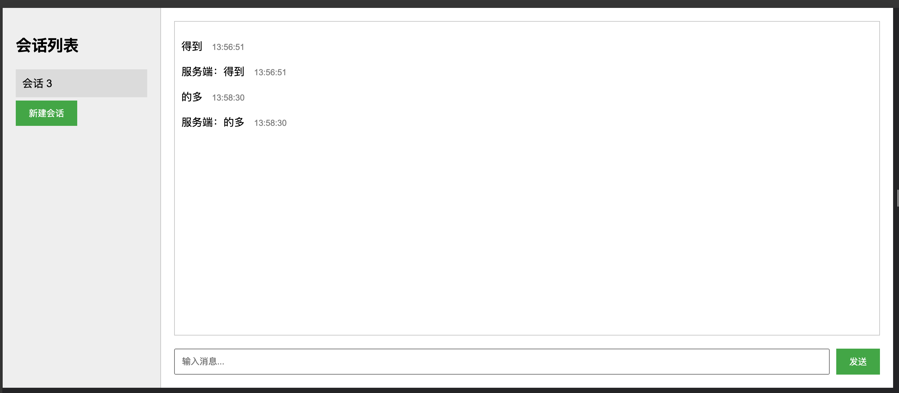

# WebSocket 聊天应用

这是一个使用Go语言后端和JavaScript前端实现的简单WebSocket聊天应用。



## 目录

- [WebSocket 聊天应用](#websocket-聊天应用)
  - [目录](#目录)
  - [功能特点](#功能特点)
  - [技术栈](#技术栈)
  - [如何运行](#如何运行)
    - [前提条件](#前提条件)
    - [运行服务器](#运行服务器)
    - [运行客户端](#运行客户端)
  - [使用说明](#使用说明)
  - [项目结构](#项目结构)
  - [注意事项](#注意事项)
  - [贡献](#贡献)
  - [许可](#许可)

## 功能特点

- 实时聊天：使用WebSocket进行实时双向通信
- 多会话支持：用户可以创建和切换不同的聊天会话
- 时间戳：每条消息都显示发送和接收时间
- 服务器回声：服务器会对每条消息进行确认回复

## 技术栈

- 后端：Go 1.16+ 
- WebSocket库：gorilla/websocket
- 前端：HTML5, CSS3, JavaScript (ES6+)
- 通信协议：WebSocket

## 如何运行

### 前提条件

- Go 1.16 或更高版本
- 安装 gorilla/websocket 包：
  ```
  go get github.com/gorilla/websocket
  ```

### 运行服务器

1. 克隆此仓库：
   ```
   git clone https://github.com/yourusername/websocket-chat-app.git
   cd websocket-chat-app
   ```
2. 运行服务器：
   ```
   go run main.go
   ```
3. 服务器将在 8880 端口启动

### 运行客户端

1. 在浏览器中打开 `index.html` 文件
2. 确保WebSocket连接地址正确（默认为 `ws://localhost:8880/ws`）

## 使用说明

1. 打开客户端页面后，点击"新建会话"按钮创建一个新的聊天会话
2. 在输入框中输入消息，点击"发送"按钮或按回车键发送消息
3. 您可以创建多个会话，并通过点击左侧的会话列表来切换不同的会话
4. 每条消息都会显示发送和接收时间

## 项目结构

- `main.go`：后端服务器代码
- `index.html`：前端页面和JavaScript代码
- `go.mod`：Go模块定义文件

## 注意事项

- 这是一个简单的演示项目，没有实现用户认证和消息持久化
- 在实际生产环境中，请确保添加适当的安全措施和错误处理

## 贡献

欢迎提交问题和改进建议！如果您想为这个项目做出贡献，请提交pull request。

## 许可

此项目采用MIT许可证。详情请见LICENSE文件。